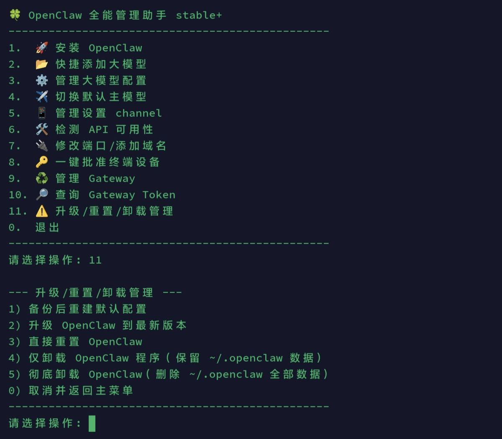

# openclaw-ocm

一个基于菜单的 OpenClaw 一键管理脚本（安装 / 配置 / 启停 / 日志 / 通道 / 大模型），主打“开箱即用、一气呵成”。

A menu-driven one-click manager script for OpenClaw (install / configure / start/stop / logs / channels / models), designed to be quick and practical.



---

## 优点 / Why this script is useful

- **一步到位**：安装 OpenClaw、生成配置、启动 Gateway、添加模型/通道，尽量用一套菜单闭环完成。
- **尽量不踩坑**：把实际遇到的坑（配置键写错、服务不常驻、终端显示差异等）固化成脚本逻辑。
- **偏运维友好**：常用检查/日志/启停入口集中，避免每次翻文档。
- **尽量少暴露敏感信息**：涉及 token 的地方默认不在日志里明文扩散（仍建议你自己注意打码）。

## 近期改进（排坑记录）/ Recent fixes that prevent common pitfalls

- **修复 Telegram Channel 编辑逻辑**：避免写入非法配置键 `channels.telegram.type`，并支持直接更新 `botToken`（保留 allowlist / dmPolicy）。
- **避免 Gateway 夜间“消失”**：在安装 Gateway 系统服务后自动执行 `loginctl enable-linger root`，防止 root 的 user service 因无登录会话而停止，导致 Telegram 无回复。
- **时间同步**：排障时确认/推荐启用 NTP（如 `chrony`），避免时间漂移导致 TLS/网络类问题更难查。

> 注：不同终端对 Emoji/宽度的渲染差异较大，菜单对齐以“功能正确”为第一优先。

---

## 快速开始 / Quick start (one-liner)

```bash
wget -O ocm.sh https://raw.githubusercontent.com/ttbb1211/openclaw-ocm/main/ocm.sh && bash ocm.sh
```

功能简介 / What it does

• 安装 OpenClaw（通过 npm -g openclaw@latest）
• 创建/更新配置：~/.openclaw/openclaw.json
• 启动/停止/重启 OpenClaw Gateway（优先走 systemd user service）
• 快捷添加/管理大模型 Provider（预设 + 自定义 BaseURL）
• 管理 Channel（Telegram Bot 等）
• 常用运维工具：健康检查、查看日志、设备配对/批准等

───

安全提示 / Security notes

• 不要在截图/日志里泄露任何密钥：API Key、Bot Token、Gateway Token、Clawhub Token 等。
• “查询 Gateway Token”界面默认打码显示（可交互选择是否显示完整 token）。
• 建议保持网关绑定 loopback (127.0.0.1)，除非你明确理解暴露到公网/LAN 的风险。

───

环境要求 / Requirements

| 项目 | 最低配置 | 推荐配置 |
|---|---:|---:|
| 操作系统 | Ubuntu 20.04 LTS+（或 Debian 11/12） | Ubuntu 22.04/24.04 LTS（或 Debian 12） |
| CPU | 2 核+ | 4 核+ |
| 内存 | 4GB RAM | 8GB RAM |
| 存储 | 2GB 可用（仅脚本+依赖；媒体库另算） | 10GB 可用（建议留日志/缓存空间；媒体库另算） |
| 其他 | 稳定网络、root/sudo 权限 | 稳定网络、root/sudo 权限；建议开启 swap 2–4GB 避免偶发 OOM |

**软件/依赖 / Software:**
• Linux + bash
• curl、jq（脚本会尝试自动安装）
• node + npm（用于安装 OpenClaw）

───

仓库文件 / Repo layout

• ocm.sh — 主脚本 / main script

───

免责声明 / Disclaimer

请先阅读脚本内容再运行，尤其是在生产环境或公网服务器上。

Review the script before running, especially on production/public servers.
